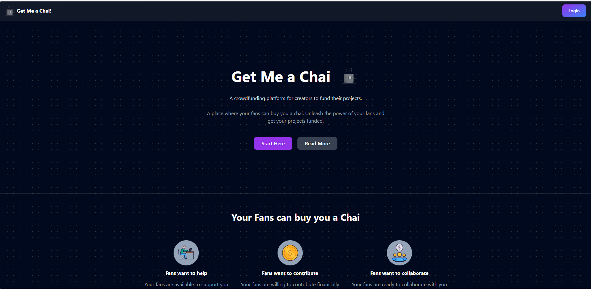
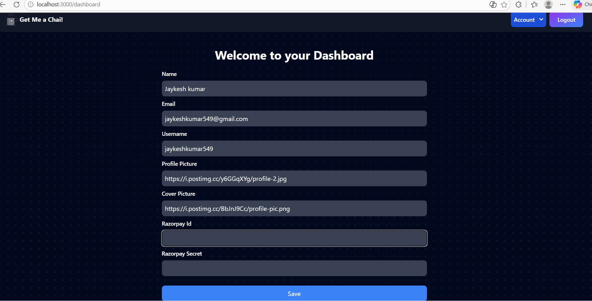
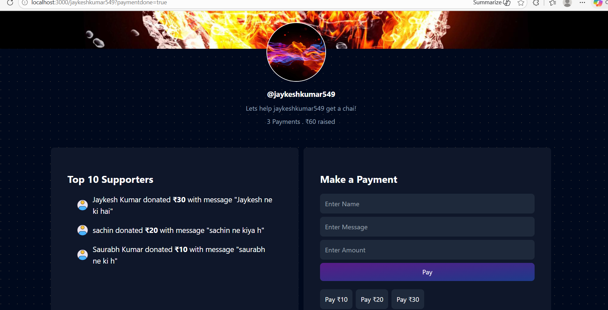

# ☕ Get Me A Chai

A full-stack web application where creators can receive support from their audience through secure online payments.

The idea is inspired by platforms like **Buy Me a Coffee**, where supporters can financially contribute to creators they like. I built this project to get hands-on experience with real-world full-stack development, authentication, payment integration, database handling, and deployment.

## Live Project

🔗 https://get-me-a-chai-one-jade.vercel.app

## Demo Video

🎥 https://youtu.be/bWft78-M7Yg

---

## Project Overview

Get Me A Chai allows creators to create their own public support page where followers can contribute money and leave messages.

After logging in, creators can manage their profile, add payment details, and personalize their support page.

Supporters can visit any creator’s page and make secure payments through Razorpay.

This project gave me practical experience in building and deploying a complete full-stack application instead of just working on isolated frontend components.

---

## Features

- Secure login using GitHub OAuth
- Authentication and session management with NextAuth.js
- Personalized creator dashboard
- Dynamic public creator pages
- Razorpay payment integration
- Payment verification after successful transactions
- Supporter contribution feed with messages
- MongoDB database integration
- Responsive user interface
- Full deployment on Vercel

---

## Tech Stack

**Frontend**
- Next.js
- React.js
- Tailwind CSS

**Backend**
- Next.js API Routes
- Server Actions

**Authentication**
- NextAuth.js
- GitHub OAuth

**Database**
- MongoDB
- Mongoose

**Payments**
- Razorpay

**Deployment**
- Vercel

---

## Screenshots

### Home Page

### Dashboard

### Creator Payment Page

---

## What I Learned

Building this project helped me understand:

- How OAuth authentication works in real applications
- Managing sessions and protected routes
- Working with MongoDB schemas and database operations
- Building dynamic routes in Next.js
- Integrating third-party payment gateways
- Handling secure payment verification
- Managing environment variables in production
- Deploying full-stack applications
- Debugging production issues and configuration problems

---

## Challenges I Faced

Some real issues I encountered while building this:

- MongoDB connection failures in production
- GitHub OAuth redirect mismatch errors
- Environment variable configuration mistakes
- Dashboard data loading issues
- Payment verification debugging

Fixing these problems taught me much more than simply writing code.

---

## Future Improvements

Planned enhancements:

- Email notifications after successful payments
- Creator analytics dashboard
- Profile image upload with cloud storage
- Better mobile optimization
- Creator discovery page
- Admin controls and moderation features

---

## Author

**Jaykesh Kumar**

GitHub: https://github.com/JAYKESH-KUMAR

---

This project was built as part of my learning journey in full-stack web development and to showcase practical development skills.